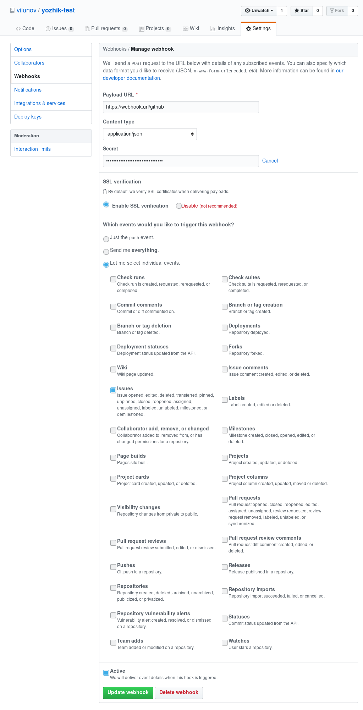

# ёжик

This is the source code repository for [Yozhik], automatic issue closer for Github

[Yozhik]: https://github.com/soramitsu/yozhik

## Deployment

This project can use Docker as a deployment platform.
Building the image is as easy as running this command in the repo directory:

```sh
docker build -t soramitsu/yozhik:latest .
```
   
## Environment Variables

`YOZHIK_WEBHOOK_ADDRESS` - the address for binding the web-server to.
Consists of the interface address and port number, e.g.: `0.0.0.0:8080`.

`YOZHIK_GITHUB_TOKEN` - the Github API key, which can be received in your [profile settings].
This API key has to have access to `repo` scope.

`RUST_LOG` - logging level, possible values: `trace`, `info`, `warn`, `error`.

### Jira Environment Variables

These are required only for integrating with Jira.

`YOZHIK_JIRA_EMAIL` - email of the bot's account.

`YOZHIK_JIRA_TOKEN` - API token, it can be acquired in the **Security** tab of your 
[profile settings](images/jira-api-token.png).

`YOZHIK_JIRA_API` - the address of your Jira organization with the trailing slash, e.g. `https://vilunov.atlassian.net/`.

`YOZHIK_JIRA_ISSUE_ID_DEFAULT` - the default issue type ID, `10002` if not specified.

[Profile settings]: https://github.com/settings/tokens

## Configuration Files

These files have to be stored either in the `config` subdirectory or in the `/etc/yozhik` system directory.

`comment.md` - contains the text of a comment which will be left after closing the issure.

`webhook_key` - the key which has to be put in the `secret` field during Github webhook configuration.
This file will be generated automatically if it does not exist.

`config.toml` - this file contains settings for linking Github repos with Jira projects. It should contain settings
for each repository in a subblock. Example of a block:
```toml
["vilunov/yozhik-test"]
jira-project-key = "YT"
jira-issue-type-id = "10002"
```
This example describes the repo name at Github, the project code in the Jira organization,
and issue type ID (task in this case).


## Configuring Webhook

You can create a new webhook in your repository settings, subsection `Webhooks`. Press `Add webhook` and enter following settings:
- Payload URL: the public address of this instance including the port and `/github` at the end. Example: `http://localhost:1337/github`
- Content type: `application/json`
- Secret: the string from the `webhook_key` file
- Which events would you like to trigger this webhook?: Let me select individual events. - Issues
- Active: checked

After that, press big green button `Add webhook`.

This procedure must be repeated for every repository you want to use with Yozhik.

<details>
<summary>Example of configuration:</summary>
<p>

</p>
</details>

## Configuring Jira Integration

Firstly, you need to setup an account with an API key and restart the service with correct 
[environment variables](#jira-environment-variables). Then you need to create the 
[configuration file](#configuration-files) with Jira project settings for each repo.
